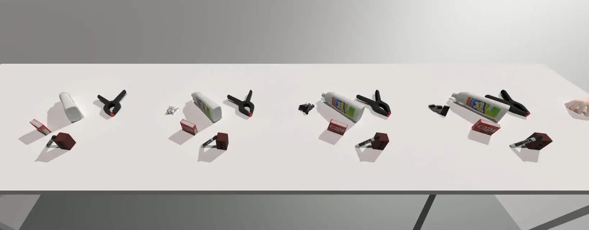

<div align="center">
  <h1 align="center"> Dex Retargeting </h1>
  <h3 align="center">
    Various retargeting optimizers to translate human hand motion to robot hand motion.
  </h3>
</div>
<p align="center">
  <!-- code check badges -->
  <a href='https://github.com/dexsuite/dex-retargeting/blob/main/.github/workflows/test.yml'>
      
  </a>
  <!-- issue badge -->
  <a href="https://github.com/dexsuite/dex-retargeting/issues">
  
  </a>
  <a href="https://github.com/dexsuite/dex-retargeting/issues?q=is%3Aissue+is%3Aclosed">
  
  </a>
  <!-- release badge -->
  <a href="https://github.com/dexsuite/dex-retargeting/tags">
  
  </a>
  <!-- pypi badge -->
  <a href="https://github.com/dexsuite/dex-retargeting/tags">
  
  </a>
  <!-- license badge -->
  <a href="https://github.com/dexsuite/dex-retargeting/blob/main/LICENSE">
      
  </a>
</p>
<div align="center">
  <h4>This repo originates from <a href="https://yzqin.github.io/anyteleop/">AnyTeleop Project</a></h4>
  
</div>

## Installation

```shell
pip install dex_retargeting
```

To run the example, you may need additional dependencies for rendering and hand pose detection.

```shell
git clone https://github.com/dexsuite/dex-retargeting
cd dex-retargeting
pip install -e ".[example]"
```

## Examples

### Offline retargeting from human hand video

This type of retargeting can be used for applications of offline retargeting.

First, obtain the estimation results stored in a JSON file with the following structure:

```json
{
  "rvec": [
    [rvec_of_frame_0], 
    [rvec_of_frame_1],
    ...
    [rvec_of_frame_(T-1)]
    // (T,3), rotation vector.
  ],
  "tvec": [
    [tvec_of_frame_0], 
    [tvec_of_frame_1],
    ...
    [tvec_of_frame_(T-1)]
    // (T,3), translation vector.
  ],
  "pred_3d_joints": [
    [
      [j0.x, j0.y, j0.z],
      [j1.x, j1.y, j1.z],
      ...,
      [j20.x, j20.y, j20.z]
    ],
    ...
    // (T,21,3), MANO hand pose, total of T frames.
  ]
}
```

Second, within the example/position_retargeting:

```python
python offline_retargeting.py   \
  --dexycb-dir /coc/flash7/yliu3735/datasets/test/4.json \
  --out-video /coc/flash7/yliu3735/workspace/dex-retargeting/output.mp4   \
  --robots allegro panda ability leap \
  --fps 30
```

### Retargeting from human hand video

This type of retargeting can be used for applications like teleoperation,
e.g. [AnyTeleop](https://yzqin.github.io/anyteleop/).

[Tutorial on retargeting from human hand video](example/vector_retargeting/README.md)

### Retarget from hand object pose dataset



This type of retargeting can be used post-process human data for robot imitation,
e.g. [DexMV](https://yzqin.github.io/dexmv/).

[Tutorial on retargeting from hand-object pose dataset](example/position_retargeting/README.md)

## FAQ and Troubleshooting

### Joint Orders for Retargeting

URDF parsers, such as ROS, physical simulators, real robot driver, and this repository, may parse URDF files with
different joint orders. To use `dex-retargeting` results with other libraries, handle joint ordering explicitly **using
joint names**, which are unique within a URDF file.

Example: Using `dex-retargeting` with the SAPIEN simulator

```python
from dex_retargeting.seq_retarget import SeqRetargeting

retargeting: SeqRetargeting
sapien_joint_names = [joint.get_name() for joint in robot.get_active_joints()]
retargeting_joint_names = retargeting.joint_names
retargeting_to_sapien = np.array([retargeting_joint_names.index(name) for name in sapien_joint_names]).astype(int)

# Use the index map to handle joint order differences
sapien_robot.set_qpos(retarget_qpos[retargeting_to_sapien])
```

This example retrieves joint names from the SAPIEN robot and `SeqRetargeting` object, creates a mapping
array (`retargeting_to_sapien`) to map joint indices, and sets the SAPIEN robot's joint positions using the retargeted
joint positions.

## Citation

This repository is derived from the [AnyTeleop Project](https://yzqin.github.io/anyteleop/) and is subject to ongoing
enhancements. If you utilize this work, please cite it as follows:

```shell
@inproceedings{qin2023anyteleop,
  title     = {AnyTeleop: A General Vision-Based Dexterous Robot Arm-Hand Teleoperation System},
  author    = {Qin, Yuzhe and Yang, Wei and Huang, Binghao and Van Wyk, Karl and Su, Hao and Wang, Xiaolong and Chao, Yu-Wei and Fox, Dieter},
  booktitle = {Robotics: Science and Systems},
  year      = {2023}
}
```

## Acknowledgments

The robot hand models in this repository are sourced directly from [dex-urdf](https://github.com/dexsuite/dex-urdf).
The robot kinematics in this repo are based on [pinocchio](https://github.com/stack-of-tasks/pinocchio).
Examples use [SAPIEN](https://github.com/haosulab/SAPIEN) for rendering and visualization.

The `PositionOptimizer` leverages methodologies from our earlier
project, [From One Hand to Multiple Hands](https://yzqin.github.io/dex-teleop-imitation/).
Additionally, the `DexPilotOptimizer`is crafted using insights from [DexPilot](https://sites.google.com/view/dex-pilot).
